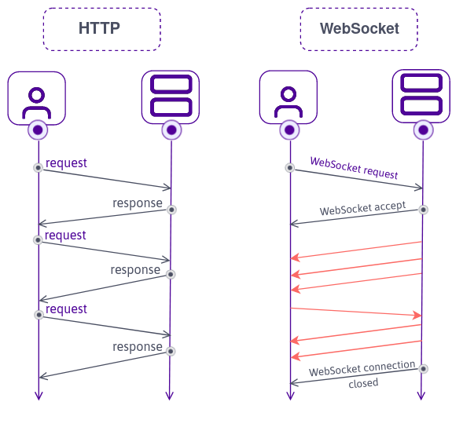

# WebSocket

## HTTP vs WebSocket 프로토콜



## WebSocket

```bash
npm i ws
```

### Frontend

#### app.js

```js
const socket = new WebSocket(`ws://${window.location.host}`); // WebSocket Web API

socket.addEventListener("open", () => {
  console.log("Connected to Server ✅");
});

socket.addEventListener("message", (message) => {
  console.log("Just got this: ", message.data, " from the server.");
});

socket.addEventListener("close", () => {
  console.log("Disconnected from Server ❌");
});

setTimeout(() => {
  socket.send("hello from the browser!!!");
}, 10000);
```

### Backend

#### server.js

```js
import http from "http";
import WebSocket from "ws";

const server = http.createServer(app); // http 서버
const wss = new WebSocket.Server({ server }); // websocket 서버

wss.on("connection", (socket) => {
  // console.log(socket);
  console.log("Connected to Browser ✅");

  socket.on("message", (message) => {
    console.log(message.toString("utf8"));
  });

  socket.on("close", () => {
    console.log("Disconnected from Browser ❌");
  });

  socket.send("hello!!!");
});

server.listen(PORT, () => {
  console.log(`Listening on http://localhost:${PORT}`);
}); // 동일한 포트에서 http, websocket request 모두 처리 가능
```
